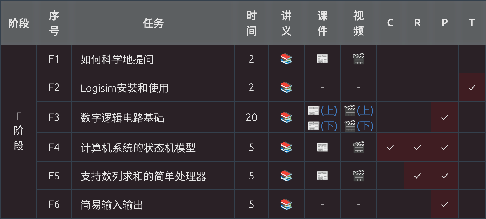
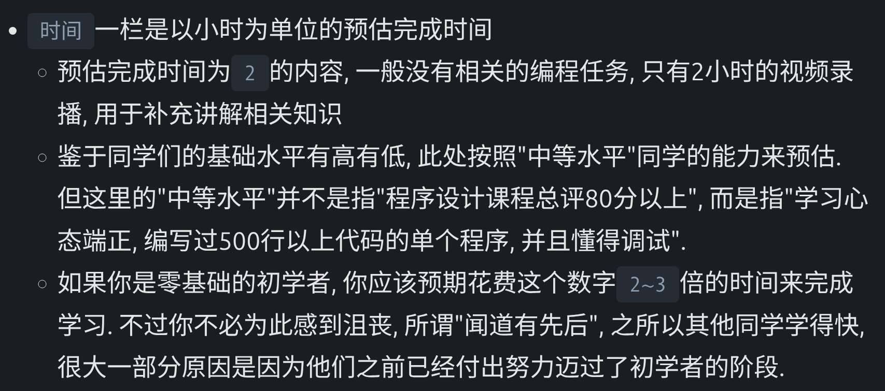
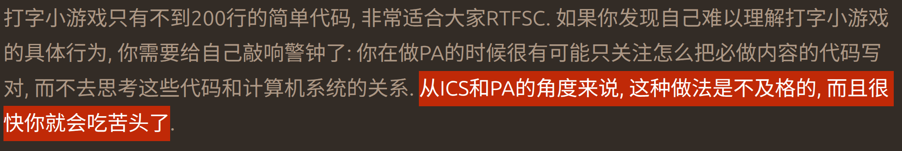
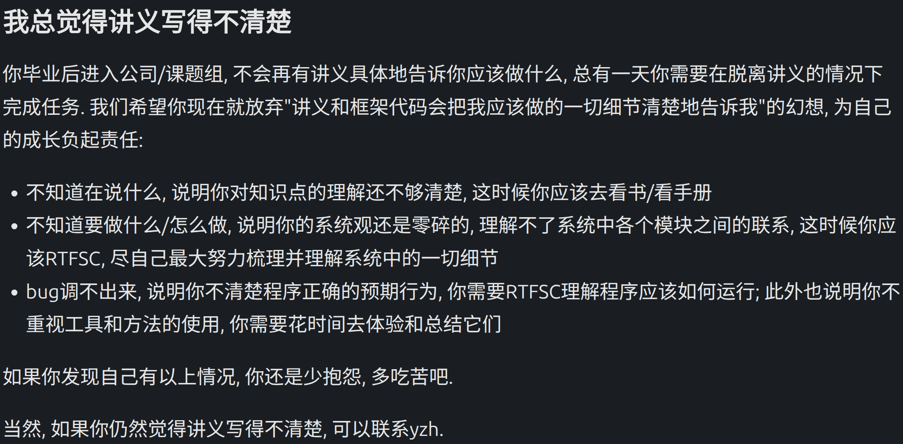
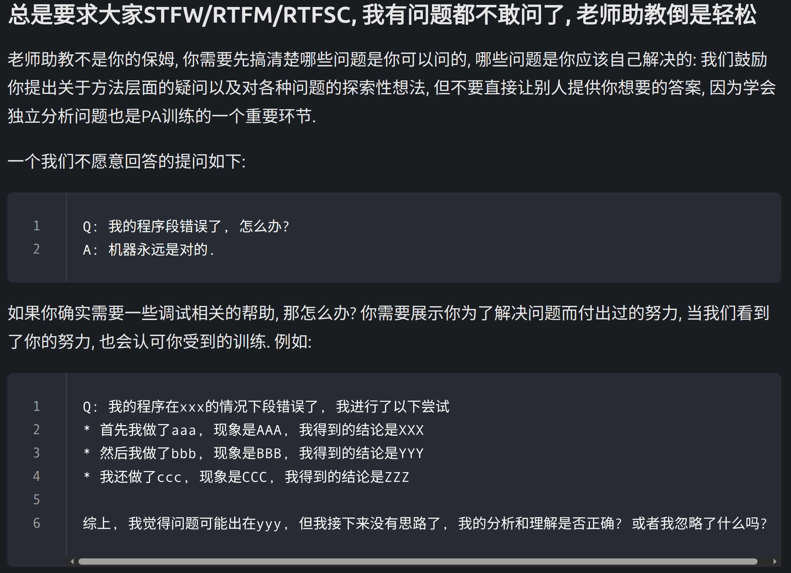

# 如何正确对待讲义

> [**ysyx官方讲义**](https://ysyx.oscc.cc/docs/)是我们学习的主要教材

## 认清课程定位

ysyx不是应试作业，而是完整的芯片工程训练。

### 传统课程 vs 一生一芯
>|  | 核心目标 | 知识点 | 作业类型 | 作业答案 | 
>| :--- | :--- | :--- | :---: | :--- |
>| 传统课程 | 理解原理，应付考试 | 定义定理结论； 以理论为主 | 练习题 | 有参考答案 |
>| 一生一芯 | 从零设计、实现一个能跑软件的 RISC‑V 处理器； 完整走完从代码到流片的工程链路； 训练工程解决问题的能力 | 工程指引+参考思路； 以实践为主 | 实验题 | 无参考答案， 需自行根据结果判断 |

## 接纳客观时间差异

讲义的课程介绍中有一个表格，上面有一栏“**时间**” 

 

  

 

这个预估学时是有中等基础的学员的标准，以下是官方讲义的描述 

 

  

 

所以不必担心自己学的太慢，也**不要羡慕**那些进度特别快的同学。我们学习的目的是为了成为“真正的高手”，而不是为了攀比进度，过快的进度往往意味着你跳过了很多需要思考的细节，等你到了答辩考核，或者是更高阶段的学习，你会为你的“快”付出相应的**代价** 

 

  

 

## 放平心态，拒绝内耗

ysyx讲义是我们设计处理器的设计手册，但是请**不要**有“先通读一遍讲义再动手”的想法。因为芯片软硬件抽象度高，纯文字阅读极易遗忘、理解空洞，正确的做法是根据讲义内容同步实现结果，并紧随其后完成对应的必做题。当我们忘记一个讲义的概念时，立刻回到讲义原文，重新阅读以加深印象。

而在完成必做题的过程中，难免会出现大大小小的bug，有一些bug是讲义特意留下来让我们自己解决的，所以遇到bug请不要质疑讲义，除非你有非常确切的证据，这时候你可以向助教们提出，或者直接到ysyx官网提交。

 

  

 

提高debug能力也是ysyx的目标之一，因为一个合格的工程师不仅要熟悉自己的代码，也要在碰到bug的时候能够迅速修复。有时候一个bug可能只需加一个标点符号，有时候则可能需要将整个项目推倒重来。代码反复报错是ysyx学习者的家常便饭，一个项目所有的代码一次全部写对的概率几乎为0，所以遇到bug**不要气馁**，根据报错信息或者讲义细节，你总能找到报错根源。当你解决了一些bug，最终实现了特定的功能，特别是大型的项目如F6的minirv，E6的nemu（24.07版本），那么你将获得非常强烈的成就感（这有可能就是你学习ysyx正反馈能量的源头）。

ysyx的目的不是让我们将知识点“死记硬背”，而是在实践的过程中理解每一个知识点，所以在读讲义的过程中请不要以中学阶段背书的心态对待，而是要在读讲义的过程中思考“为什么要这样设计”，进而理解讲义中的各个步骤。

# 如何正确对待提问

首先推荐大家看看“[提问的智慧](https://github.com/ryanhanwu/How-To-Ask-Questions-The-Smart-Way/blob/main/README-zh_CN.md)”和“[别像弱智一样提问](https://github.com/tangx/Stop-Ask-Questions-The-Stupid-Ways/blob/master/README.md)”这两篇文章，预学习答辩也会要求大家提交这两篇文章的读后感。

向大佬提问是一件非常正常的事，但是大佬们的时间都是很宝贵的，所以向大佬提问前**请先使用“大佬三连”**（STFW，RTFM，RTFSC）看看自己是否能够解决问题，确定自己无法解决或者没有思路解决，再使用“提问的智慧”中的提问技巧向大佬们提问。有时大佬们的回答可能你也会听不懂，所以请再次进行“大佬三连”。

 

  

 

当你碰到一个bug，且已经卡了相当长的时间依旧无法解决，不要死磕，尝试向大佬们提问，因为你在使用“提问的智慧”的技巧的时候也有可能找到bug的来源。还没解决也没关系，找到大佬发送问题，大佬会给你一定的思路的。

# 如何正确对待AI

随着AI的快速迭代，AI已经成为了我们日常生活中必不可少的工具。不可否认的是AI确实很强，可以帮助我们做特别多的事，但是在一生一芯的学习过程中，**请不要使用AI完成任何一个必做题**。每一个必做题都有其设计的道理，如果你使用AI来完成，那么你并不能从其中学会任何知识，除了如何使用AI。正确的做法是把AI当作一个辅助你学习工具，或者是ysyx大佬，而不是让ta替你学习。如果你忽略掉了这条建议，那么你很有可能会在答辩的时候回答不出任何问题（特别是预学习和C阶段的答辩），看起来像第一天认识自己的代码，即便你已经完成了讲义所有的必做题（这是真实发生过的事）。

## 如何正确使用AI

以下为使用AI的一些建议

> - 不要过度相信AI，AI生成的内容可能有误，要结合其他的内容（如常识，代码输出等）来评估其是否正确
> - 使用前告诉AI不要直接生成代码，而是以引导的方式回答问题
> - 如果要让AI帮忙查找手册中的内容，要求AI把手册原文的位置也告诉你
> - “提问的智慧”中的提问技巧同样适用于向AI提问

如果你想更好的使用AI，或者不知当下这个时代如何正确使用AI，可以看看“[给 AI 时代的“一生一芯”初学者的一封信](https://fa45epzd9c7.feishu.cn/wiki/AOXwwtY0EiCXZykBPTtcIVfWn6f)”,这篇文章会对你有所帮助。

