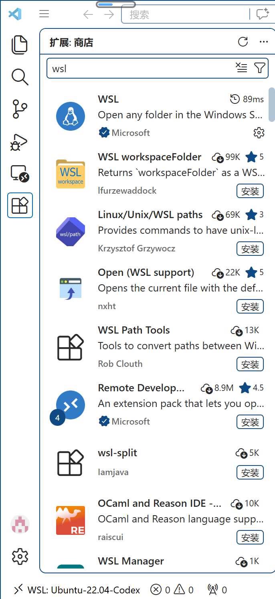

# 0827分享会Q&A

### Q1：显示：请求的操作需要提升

A1：一般电脑会弹出窗口，按“是”即可。如果没有，改用管理员身份运行powershell

### Q2：vim编辑器咋使用？

A2：vim的哲学在于不用鼠标，仅使用键盘来进行coding。对于新手我们推荐visual studio code/gedit编辑器，如果你确实希望使用vim，建议阅读<https://missing-semester-cn.github.io/2020/editors/>

### Q3：用vscode的插件编译和用Ubuntu的g++编译，这俩有啥区别？

A3：检查vscode左下角的远程连接图标是否连接wsl，若你配置正确，则可以认为你的vscode的终端已经接入了wsl的终端，所以可视为没有区别

### Q4：如果wsl仍然无法安装该如何是好？

A4：可以考虑VirtualBox等图形化虚拟机，可以网上自行搜索教程

### Q5：为什么VSCode的拓展里面搜不到wsl插件?

A5:如图，是可以搜索到的

  

> Still Working in Progress
