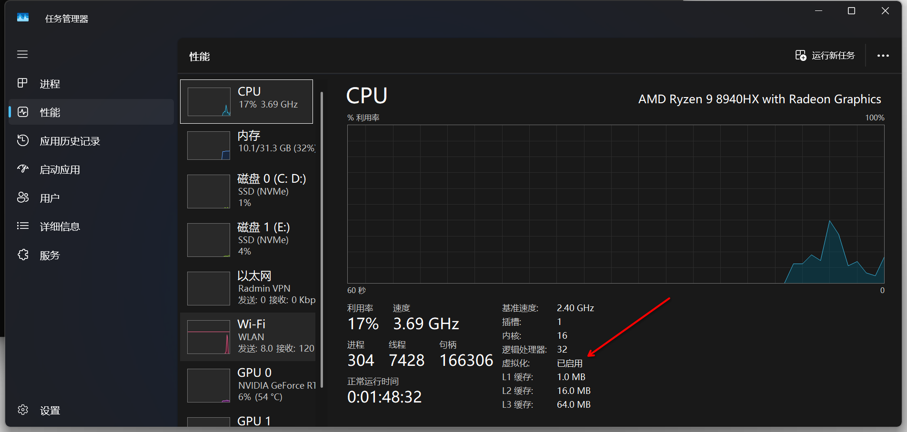
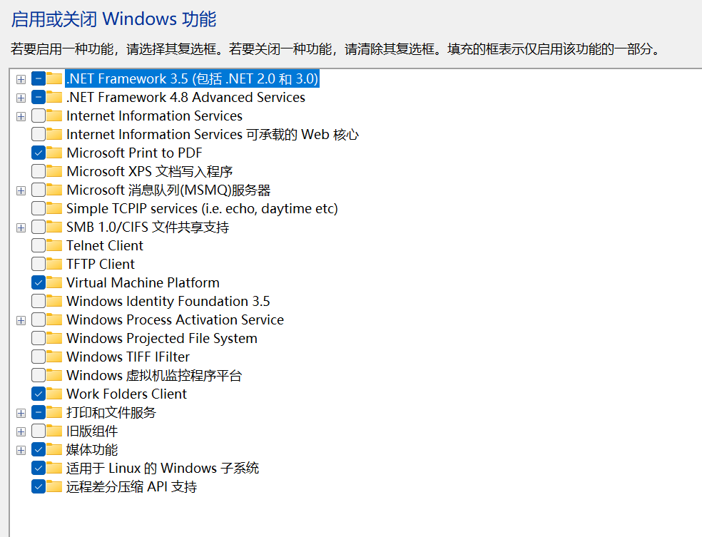
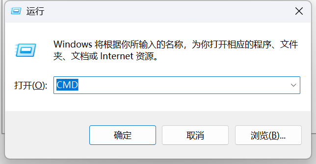
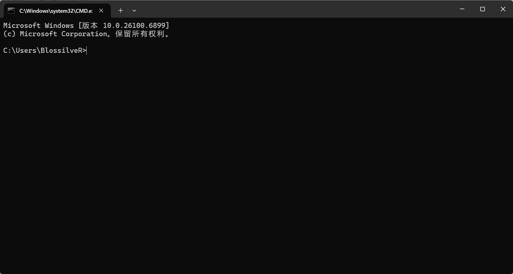

# WSL Installation Guide

本教程为2026.08.27分享会上Wsl安装教程的文字版，同时作了些许补充，总体内容为从0开始安装WSL，一直到配置好支持完成C++作业。

## Step 1: 启用虚拟化&WSL功能

首先，打开windows的任务管理器->性能->CPU，查看虚拟化是否启用，
<p align="center">
  
</p>
如果显示为“已启用”，则可直接查看Step 2

如果没有启用，请进入BIOS设置开启虚拟化。
具体操作为电脑刚开机时，根据你的电脑型号按下相应的快捷键进入BIOS设置（如我的联想r7000p是通过开机时快速连续按下F2进入BIOS，thinkpadx390则是按下F1进入BIOS），找到“VT-d”或“AMD-V”等有关CPU虚拟化的选项，将其设置为“Enabled”，然后保存并退出BIOS。如果找不到选项在哪里，可在网上自行搜索你电脑型号的CPU虚拟化开启教程。

接着打开“控制面板”->“程序”->“启用或关闭Windows功能”，勾选“适用于Linux的Windows子系统”和“虚拟机平台(Virtual Machine Platform)”，然后点击确定，
并重启电脑更改生效。

<p align="center">
  
</p>

重启后打开cmd终端，可通过`Windows + R`快捷键，输入`cmd`打开终端。

<p align="center">
  
</p>

看到出现这样一个黑框框，则说明你已经成功打开了cmd终端。

<p align="center">
  
</p>

输入`wsl --update`以更新WSL到最新版本。
接着输入`wsl --version`检查当前WSL状态。

## Step 2: 安装Linux发行版

这里以安装Ubuntu为例，可以通过输入`wsl --install -d Ubuntu`来安装Ubuntu发行版。

安装时，你可能遇到以下问题：

- 报错`403 Forbidden`，提示无法下载Ubuntu镜像包。  
  解决方法：请检查网络环境，确保可以访问微软的服务器，或者尝试使用网络代理。
- 报错`WINNET_E_CONNECTION_NAME_NOT_RESOLVED`，提示无法解析服务器的名称。  
  解决方法同上
- 如果提示重启，则请重启电脑后继续配置。
- 其他的问题欢迎向学长学姐们反馈。

## Step 3: 配置WSL环境

安装完成Ubuntu后，则可通过键入`wsl`进入Ubuntu系统。
首次启动会提示你创建一个新的用户账户和密码。这里有几个注意事项：

- 用户名要求不能以大写字母开头，只允许包含字母、数字和下划线，另外建议长度不要过长，最好是3-16字符。
- 密码建议不需要太长，因为后续需要频繁输入密码。**一定要记住自己设置的密码**
- 最后可能会询问你是否要`opt-in to platform metrics collection`，这里输入`y`或`n`都可以。
  此处意思是是否允许微软收集平台指标数据，选择`y`表示同意，选择`n`表示不同意。

最后，当你看到`$`符号时，说明你已经成功进入了Ubuntu系统。

但此时的WSL还无法作为我们C++作业的完成平台，还需要配置一些必要的工具和环境。
可以直接输入

<!-- markdownlint-disable MD014 -->

```bash
$ sudo apt update
$ sudo apt install build-essential gdb
```
<!-- markdownlint-enable MD014 -->

此处build-essential是一个包含了C/C++编译器和一些常用工具的包，gdb是GNU调试器，用于调试程序。
完成了这些，你可以通过输入`g++ --version`和`gdb --version`来检查是否安装成功。

完成了以上步骤，你就已经可以使用g++编译你的C++代码了。
你可以使用nano vim VSCode来编写你的代码，其中VSCode的使用可通过键入`code .`来打开当前目录下的文件夹。

> 如果你在使用`code .`时遇到报错，提示`code`命令未找到，请先安装VSCode，
> 并在安装时勾选“将VS Code添加到PATH”选项或手动将VSCode的安装路径添加到系统环境变量中。

## FAQ

### 1. WSL是什么？为什么我要使用它？

什么是wsl:
 wsl(Windows Subsystem for Linux)是一个允许用户在Windows上使用Linux环境的组件，它避免了虚拟机的巨大开销，也为用户提供了一个双系统外的方案

什么是双系统：
 简单来说，你的电脑里存在两个操作系统，可以在启动的时候选择一个进入

为什么使用wsl:
 安装容易，使用简单，可以在Windows无痛使用Linux的开发环境，也避免了安装双系统的一些琐碎问题

### 2. Linux是什么，为什么要使用Linux

>  a family of free and open-source software Unix-like operating systems

Family: 不是一个操作系统，而是由很多系统（发行版）组成

Open-source: 开源，即源代码源文件公开可修改

Unix-like: 类Unix系统，感兴趣的同学可以自行了解Unix系统以及Linux的历史

学会使用Linux是成为一名合格程序员的第一步，并且学会使用Linux上的工具能极大的提高我们的开发效率
在Linux，你可以使用：

- fd: 快速查找需要的文件
- vim/neovim: 帮助你高效开发的编辑器
- sed: 帮你批量处理文本

### 3. g++/gcc的使用

除了刚刚的简单调用g++, gcc来为我们编译代码，我们还可以加很多选项帮我们做更多事情
以下是几个常用选项

- o 命名输出文件
- Wall 开启严格的编译检查，有助于你在运行前就能发现错误
- Werror 把所有的Warning当作Error处理，强迫你解决所有的Warning

更多的选项可以通过`man`查询

<!-- markdownlint-disable MD014 -->

```bash
$ sudo apt install man # 安装man软件
$ man g++ # 查看g++的使用手册
```

<!-- markdownlint-enable MD014 -->

### 4. C++这门课太难，怎么办

1. 首先，学校的C++课程课时安排少，课程要求高，对初学者/0基础确实不友好。但同时，这也是一个很好的机会，让我们在短时间内拔高coding能力，建立programmer的思维。
2. 每节课都要认真听，努力克服作业里的一切困难。
3. 积极寻求帮助，AI工具远比先前发达。学会用好AI工具，但不能太依赖，一方面是你总得要考试，但更重要的是，AI会了 !=       你会了，初学阶段一行行敲代码，自己debug，才是最好的学习方式。
4. C++作为绝大多数人的第一门编程语言，的确是有难度的，因为你现在还缺少编程能力和编程思维。学习C++不只是在学习一门语言，更是在学习如何成为一名programmer,如果你能在大一把coding的基础打扎实，你就能轻松应对其他编程语言的学习。

这里也推荐我们的工作室网站的课程文档，持续更新coding相关的内容，欢迎大家关注。

### 5. C++开发工具推荐

> [!NOTE]:
> 不要在初学阶段使用IDE！！！（比如Visual Studio）
> IDE会把程序如何运行的底层细节屏蔽起来，非常不利于初学者理解“你的代码是如何运行的”
  
- Vim/Neovim: 本人墙裂推荐，拥有先进的编程范式
- Visual Studio Code: 配置容易，功能强大，容易上手
- 其他被程序员广泛使用的工具：Helix Emacs，但作者没有使用过这些工具，不作评价。

## 资源墙裂推荐

 1. [Missing-Semester  一门帮助你上手Linux许多工具的教程](https://missing-semester-cn.github.io)
 2. [洛谷 C++语法练习](https://www.luogu.com.cn/training/list?type=srqc-jc)
 3. [一看就会！8分钟真机安装【Ubuntu/Windows】双系统-哔哩哔哩](https://b23.tv/5aDoB0s) (由ljm学长推荐)
